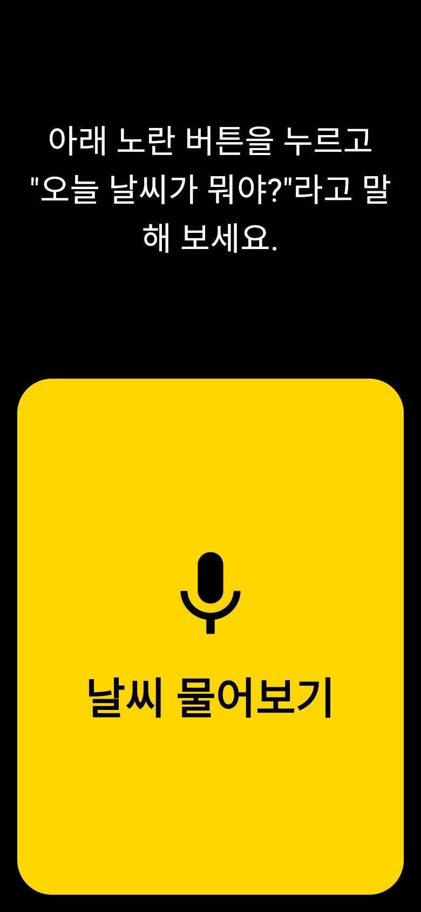
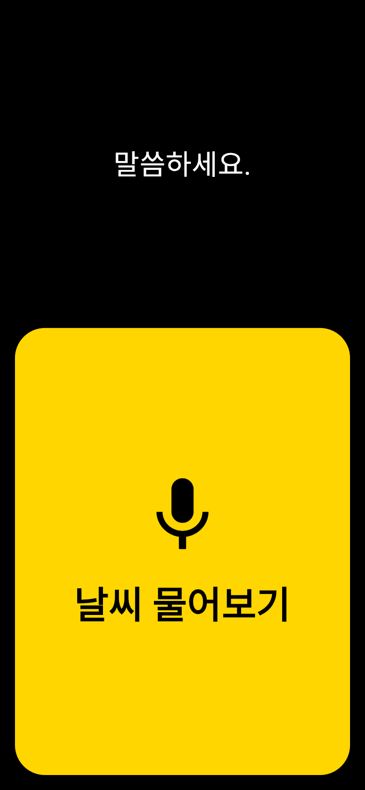
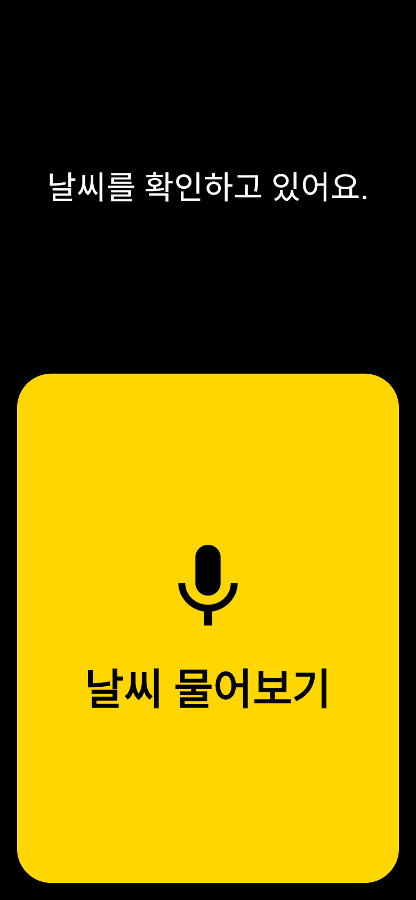
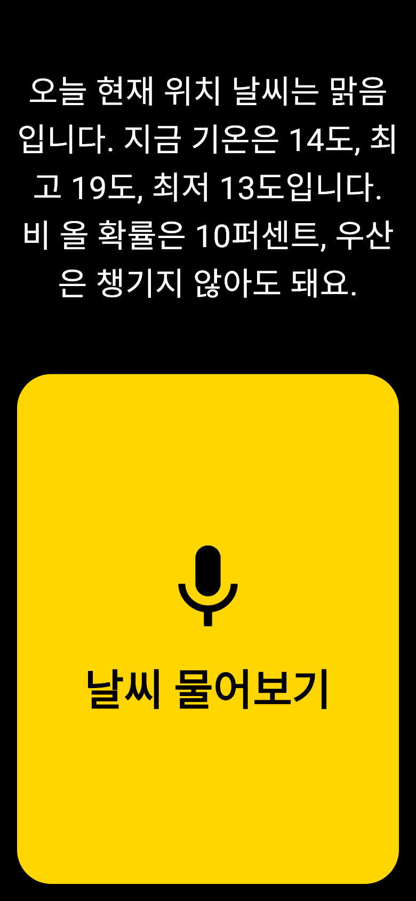
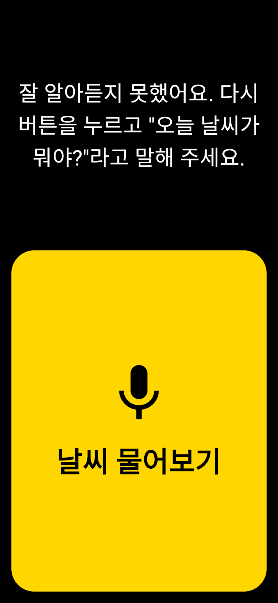

# 오늘 날씨 알리미 ☀️🔊

**시각장애인이 화면을 보지 않고도 목소리로 오늘 날씨를 물어보고, 소리로 답을 듣는 앱**입니다.

큰 노란 버튼을 누르고 *"오늘 날씨가 뭐야?"* 라고 말하면, 앱이 지금 있는 곳의 날씨를 한국어로 읽어 줍니다.

> 🔊 *"오늘 현재 위치 날씨는 맑음입니다. 지금 기온은 14도, 최고 19도, 최저 13도입니다. 비 올 확률은 10퍼센트, 우산은 챙기지 않아도 돼요."*

- 지원 환경: **iPhone(iOS)**, **웹 브라우저**
- 만든 도구: [Flutter](https://flutter.dev) (하나의 코드로 iOS와 웹 앱을 함께 만드는 도구)
- 날씨 정보: [Open-Meteo](https://open-meteo.com) (가입이나 키 없이 쓰는 무료 날씨 서비스)
- 프로젝트 위치: [`PRD/weather_app/`](PRD/weather_app)

---

## 이런 분을 위해 만들었어요

날씨 앱은 대부분 아이콘, 작은 숫자, 그래프처럼 **눈으로 보는 정보**로 가득합니다.
화면 읽기 기능(VoiceOver)을 켜도 버튼이 많고 정보가 흩어져 있어, 시각장애인은 "오늘 우산 챙겨야 해?"라는 간단한 질문의 답을 얻기까지 여러 번 화면을 쓸어 넘겨야 합니다.

이 앱은 그 과정을 **버튼 한 번 + 말 한마디**로 줄였습니다.

## 주요 기능


| 기능          | 설명                                                                                  |
| ----------- | ----------------------------------------------------------------------------------- |
| 🎙️ 목소리로 질문 | 버튼을 누르면 "말씀하세요."라고 안내한 뒤 질문을 듣습니다. "날씨 알려줘", "오늘 날씨 어때"처럼 **"날씨"가 들어간 말이면** 알아듣습니다. |
| 🔊 소리로 답변   | 하늘 상태, 지금 기온, 최고·최저 기온, 비 올 확률, 우산 필요 여부 **5가지를 한 문장으로** 읽어 줍니다.                    |
| 📍 현재 위치 날씨 | 휴대폰 위치로 지금 있는 곳의 날씨를 알려 줍니다. 위치를 알 수 없으면 그 이유를 말하고 **서울 날씨로 대신** 알려 줍니다.            |
| ☂️ 우산 안내    | 비 올 확률이 50% 이상이거나 지금 비·눈이 오면 "우산을 챙기세요."라고 말해 줍니다.                                  |
| 🔁 다시 듣기    | 화면 위를 누르면 방금 들은 날씨를 다시 읽어 줍니다.                                                      |
| 🧭 다음 행동 안내 | 못 알아들었을 때, 인터넷이 안 될 때, 마이크 권한이 없을 때 **무엇을 하면 되는지** 말로 알려 줍니다.                       |


## 화면 흐름

화면은 **한 장뿐**이에요. 위쪽 글자만 단계마다 바뀌고, 그 글자를 앱이 소리로도 읽어 줍니다.


웹 버전을 휴대폰 크기로 찍은 실제 화면이에요.

| 1. 시작 | 2. 버튼을 누르면 | 3. 질문 듣기 |
| :---: | :---: | :---: |
|  |  |  |
| 무엇을 하면 되는지 안내 | 🔊 "말씀하세요." | "오늘 날씨가 뭐야?"라고 말하기 |

| 4. 날씨 확인 중 | 5. 날씨 답변 | 6. 못 알아들었을 때 |
| :---: | :---: | :---: |
|  |  |  |
| 위치 찾기 → 날씨 가져오기 (최대 약 9초) | 🔊 날씨 5가지를 한 문장으로 읽어 줌<br/>글자를 누르면 다시 듣기 | 🔊 다시 말해 달라고 안내 |

> 날씨 답변(5번)은 예시 날씨(맑음, 14도)로 찍은 화면이에요. 인터넷·마이크·위치 문제가 있을 때 나오는 안내는 아래 [이럴 땐 이렇게 안내해요](#이럴-땐-이렇게-안내해요)에 정리했어요.

## 이 프로젝트의 장점

1. **버튼이 딱 하나예요.** 화면을 차지하는  큰 버튼 하나뿐이라, 화면 어디를 눌러야 할지 찾을 필요가 없습니다.
2. **VoiceOver(아이폰 화면 읽기 기능)와 잘 맞아요.**
 버튼과 안내 글에 "두 번 탭하면 질문을 듣기 시작합니다" 같은 사용법이 붙어 있고, 쓸어 넘기면 *안내 글 → 버튼* 순서로 읽힙니다. 앱 음성과 VoiceOver가 같은 말을 두 번 읽지 않도록 맞춰 두었습니다.
3. **저시력 사용자도 읽기 쉬운 화면이에요.**
 검은 배경에 흰색·노란색 글씨로, 글자와 배경의 밝기 차이(대비)가 국제 웹 접근성 기준(WCAG)의 가장 높은 등급인 **7:1 이상**입니다. 화면의 모든 글씨는 **28pt 이상**입니다.
4. **귀로 듣기 좋은 말투예요.**
 "-3도" 대신 **"영하 3도"**, "Clear" 대신 \*\*"맑음"\*\*처럼, 소리로 들었을 때 바로 이해되는 한국어로 바꿔 읽습니다.
5. **10초 안에 답해요.**
 위치 찾기(3초), 날씨 가져오기(4초)에 시간 제한을 두어, 상황이 나빠도 **최대 약 9초** 안에 답하거나 안내합니다. 무작정 기다리게 하지 않습니다.
6. **무음 모드에서도 들려요.**
 아이폰 옆 무음 스위치가 켜져 있어도 날씨 안내가 소리로 나옵니다.
7. **개인정보를 저장하지 않아요.**
 위치와 목소리는 날씨를 알려 주는 데만 쓰고 저장하지 않습니다. 회원가입도 필요 없습니다.
8. **자동 테스트 29개로 검증했어요.**
 날씨 문장 만들기, 우산 판단, 음성 질문 흐름, 오류 안내, 글씨 크기·대비, VoiceOver 읽기 순서까지 자동으로 확인합니다. 실제 아이폰에서 VoiceOver로도 직접 확인했습니다.

---

## 설치하고 실행하기

> 아래 명령어들은 **터미널**(Mac의 '터미널' 앱)에 한 줄씩 붙여넣으면 됩니다.

### 1. 준비물


| 준비물                                                                                  | 용도                  |
| ------------------------------------------------------------------------------------ | ------------------- |
| [Flutter SDK](https://docs.flutter.dev/get-started/install) 3.47 이상 (개발 시 3.47.6 사용) | 앱을 만들고 실행하는 도구      |
| Chrome 브라우저                                                                          | 웹 버전 실행             |
| Mac + [Xcode](https://apps.apple.com/kr/app/xcode/id497799835) + iPhone              | iOS 버전 실행 (iOS만 필요) |


설치가 잘 되었는지 확인하려면:

```bash
flutter doctor
```

↑ Flutter와 Xcode, Chrome 등이 제대로 준비되었는지 점검해 주는 명령어입니다.

### 2. 코드 내려받기

```bash
git clone https://github.com/munho-kang/How-s-the-weather.git
cd How-s-the-weather/PRD/weather_app
flutter pub get
```

↑ 코드를 내 컴퓨터로 복사하고, 앱 폴더로 들어가서, 앱에 필요한 부품(패키지)을 내려받습니다.

### 3-A. 웹에서 실행하기 (가장 쉬움)

```bash
flutter run -d chrome
```

↑ Chrome 창에서 앱을 엽니다.

- 처음 버튼을 누르면 브라우저가 **마이크 사용 허용**을 물어봅니다. "허용"을 눌러 주세요.
- 위치 허용도 물어봅니다. 거절하면 서울 날씨를 알려 줍니다.

### 3-B. iPhone에서 실행하기

1. iPhone을 USB 케이블로 Mac에 연결하고, iPhone에서 "이 컴퓨터를 신뢰" → 신뢰를 누릅니다.
2. iPhone의 **설정 → 개인정보 보호 및 보안 → 개발자 모드**를 켭니다. (처음 한 번만)
3. Xcode에서 서명 설정을 합니다. (처음 한 번만)
   ```bash
    open ios/Runner.xcworkspace
   ```

    ↑ Xcode로 iOS 프로젝트를 엽니다.
    왼쪽에서 **Runner** → **Signing &amp; Capabilities** 탭 → **Team**에서 본인 Apple 계정을 고릅니다.
4. 앱을 설치하고 실행합니다.
   ```bash
    flutter run
   ```

    ↑ 연결된 iPhone에 앱을 설치하고 켭니다.
5. iPhone에서 "신뢰하지 않는 개발자" 안내가 나오면 **설정 → 일반 → VPN 및 기기 관리**에서 본인 계정을 신뢰합니다.
6. 처음 버튼을 누르면 **위치, 마이크, 음성 인식** 권한을 물어봅니다. 모두 허용해 주세요.

> ℹ️ 실제 음성 인식과 위치는 시뮬레이터(가상 아이폰)보다 **실제 iPhone**에서 정확하게 동작합니다.

### 4. 테스트 실행하기

```bash
flutter test
```

↑ 자동 테스트 29개를 실행합니다. 마지막에 `All tests passed!`가 나오면 모두 정상입니다.

---

## 사용 방법

1. 앱을 켭니다. 화면 위쪽에 *"아래 노란 버튼을 누르고 '오늘 날씨가 뭐야?'라고 말해 보세요."* 라는 안내가 있습니다.
2. 아래쪽 **큰 노란 버튼**(날씨 물어보기)을 누릅니다.
   - VoiceOver를 켠 경우: 버튼을 한 번 탭해 선택하고, **두 번 탭**해서 누릅니다.
3. *"말씀하세요."* 소리가 나면 **"오늘 날씨가 뭐야?"** 라고 말합니다.
4. 잠시 뒤 오늘 날씨를 소리로 읽어 주고, 같은 문장이 화면에도 크게 나옵니다.
5. 다시 듣고 싶으면 **화면 위쪽 글자를 누릅니다.** (VoiceOver에서는 두 번 탭)

### 이럴 땐 이렇게 안내해요


| 상황                    | 앱이 하는 말                                               |
| --------------------- | ----------------------------------------------------- |
| 날씨 질문이 아니거나 잘 안 들렸을 때 | "잘 알아듣지 못했어요. 다시 버튼을 누르고 '오늘 날씨가 뭐야?'라고 말해 주세요."      |
| 인터넷이 안 될 때            | "날씨를 가져오지 못했어요. 인터넷 연결을 확인하고 다시 버튼을 눌러 주세요."          |
| 마이크 권한이 없을 때 (iPhone) | "설정 앱에서 오늘 날씨 알리미를 찾아 마이크와 음성 인식을 켠 뒤 다시 버튼을 눌러 주세요." |
| 마이크 권한이 없을 때 (웹)      | "브라우저 주소창 옆 마이크 아이콘에서 마이크를 허용한 뒤 다시 버튼을 눌러 주세요."      |
| 위치를 알 수 없을 때          | "위치를 알 수 없어 서울 날씨를 알려드려요." 뒤에 서울 날씨를 읽어 줍니다.          |


---

## 폴더 구성

```
PRD/weather_app/
├── lib/                  앱 코드
│   ├── main.dart         화면과 버튼, 질문→답변 흐름
│   ├── voice.dart        목소리 듣기(음성 인식)와 읽어 주기(음성 합성)
│   ├── weather.dart      날씨 가져오기와 날씨 문장 만들기
│   └── location.dart     현재 위치 찾기
├── test/                 자동 테스트 29개
├── ios/                  iPhone 앱 설정 (권한 안내 문구 등)
└── web/                  웹 앱 설정
```

## 사용한 부품(패키지)


| 패키지                                                         | 하는 일                      |
| ----------------------------------------------------------- | ------------------------- |
| [`speech_to_text`](https://pub.dev/packages/speech_to_text) | 사용자의 말을 글자로 바꿈 (음성 인식)    |
| [`flutter_tts`](https://pub.dev/packages/flutter_tts)       | 글자를 한국어 목소리로 읽어 줌 (음성 합성) |
| [`geolocator`](https://pub.dev/packages/geolocator)         | 현재 위치 찾기                  |
| [`http`](https://pub.dev/packages/http)                     | 날씨 서버에서 정보 가져오기           |


## 개발 문서

이 앱은 아래 두 문서를 바탕으로 만들었습니다.

- [`PRD/PRD.md`](PRD/PRD.md): 무엇을, 누구를 위해, 어디까지 만들지 정한 기획서
- [`PRD/Todolist.md`](PRD/Todolist.md): 기획서를 작은 작업 35개로 나눈 할 일 목록